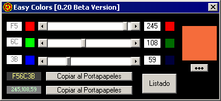

Easy Colors 
============ 
by Joan Alba Maldonado (joanalbamaldonadoNO_SPAM_PLEASE AT gmail DOT com, without NO_SPAM_PLEASE)

Colour generator and picker made in Visual Basic 4.0.

Version: 0.20 Beta 
- Date: 1999 (approximately)

Description

Simple application that lets you pick a colour and gives you the HEX and DEC codes.

Made with Visual Basic 4.0.